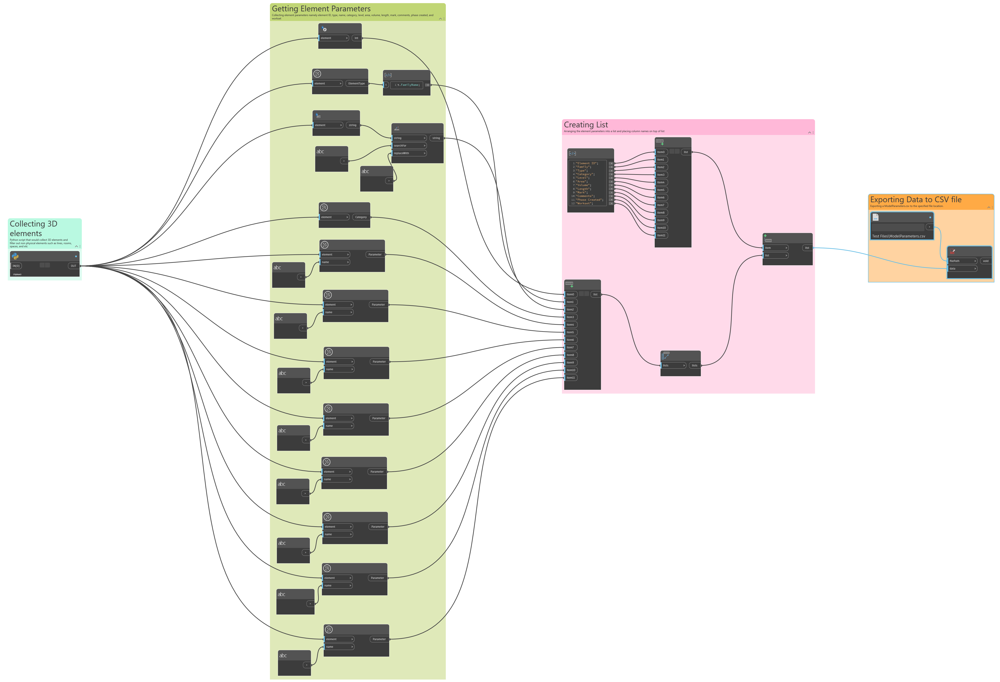
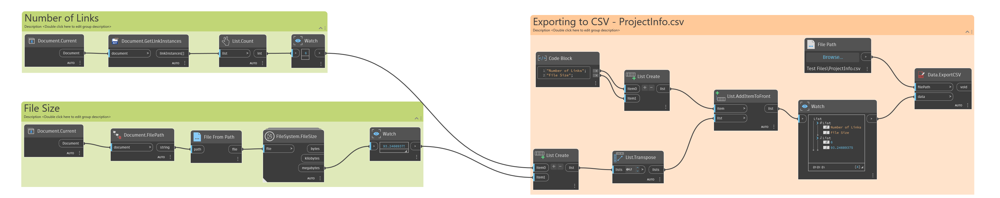
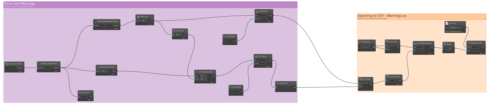

# Revit BIM Data Automation & Analytics Pipeline 

## 🏢 Dataset & Project Baseline
To ensure complete compliance with data privacy laws and intellectual property rights, this pipeline was developed and stress-tested using **Autodesk's Industry-Standard Revit Sample Architecture Project** (*Snowdon Towers Sample Architectural.rvt*). 

Using a widely recognized open baseline allows peers and recruiters to easily reproduce the entire pipeline locally.

## 🛠️ Tools & Technologies

- **Autodesk Revit 2025** — BIM model and source data
- **Dynamo v.3.3.0** — Automated Revit data extraction
- **Power Query** — Data cleaning and transformation
- **Power BI** — Data modeling and dashboard visualization
- **DAX** — Calculations and KPI measures
- **GitHub** — Project documentation and version control


## ⚡ 1. Data Extraction with Dynamo

There are 3 data sets that were extracted from the Revit file through dynamo. 

### ModelParameters Dynamo Graph


[View ModelParameters dynamo script](dynamo/ModelParameters.dyn)


The first one is the ModelParameters.csv. This dynamo script extracts the parameters namely element ID, type, name, category, level, area, volume, length, mark, comments, phase created, and workset from the model with initial data cleaning, list arrangements, and  data export into a csv file. 

The graph started with a python script that searches the Revit document and returns model elements that have actual 3D solid geometry, while excluding things such as element types, annotations, views, sheets, rooms, spaces, areas, and other non-solid/model data. 

[View full Python script](dynamo/ElementCollector.py)

Initially, I wanted to use nodes for this but I was limited with options because the existing nodes that were in dynamo required me to specify per category to be able to extract its corresponding elements which would be inefficient since I wanted to extract ALL placed model elements and not just elements from specific categories. Using a python script was the best option for this case as it can collect all model elements without the need to specify. I also added a code as highlighted below to make sure that all elements collected are 3D physical elements and to filter out all collected non physical elements such as bypassing 2D/3D model lines and spatial elements (Rooms, Spaces, Areas) by drilling down into complete geometryinstance architectures and validating true 3D surfaces. 

```diff
import clr
clr.AddReference('RevitAPI')
from Autodesk.Revit.DB import *

clr.AddReference('RevitServices')
import RevitServices
from RevitServices.Persistence import DocumentManager

doc = DocumentManager.Instance.CurrentDBDocument

# 1. Grab all element instances globally across the database background
collector = FilteredElementCollector(doc).WhereElementIsNotElementType()

physical_elements = []

geo_options = Options()
geo_options.DetailLevel = ViewDetailLevel.Coarse

# 2. Fully dynamic evaluation loop with exception handling
for elem in collector:
    if elem is None:
        continue
        
    cat = elem.Category
    if cat is None:
        continue # Drops non-graphical internal data maps
        
+   # Filter out non-3D objects early to save memory and processing time
+   if cat.CategoryType != CategoryType.Model:
+       continue # Excludes annotations, schedules, views, and sheets
        
+   if isinstance(elem, SpatialElement):
+       continue # Skip Spatial Elements (Rooms/Spaces/Areas) completely 

    # 3. DEFENSIVE CHECK: Ensure the object actually supports geometry properties 
    if not hasattr(elem, "get_Geometry"):
        continue

    # 4. Geometry Check (Separates true physical volumes from lines/curves)
    geo_elem = elem.get_Geometry(geo_options)
    if geo_elem is None:
        continue
        
    has_solid = False
    for geo_obj in geo_elem:
+       # Check direct geometry for 3D faces
        if isinstance(geo_obj, Solid) and geo_obj.Faces.Size > 0:
            has_solid = True
            break
+       # Dig into Family Instances (Doors, Windows, Furniture) to extract nested solids
        elif isinstance(geo_obj, GeometryInstance):
            instance_geo = geo_obj.GetInstanceGeometry()
            for sub_obj in instance_geo:
                if isinstance(sub_obj, Solid) and sub_obj.Faces.Size > 0:
                    has_solid = True
                    break
                    
    # 5. Keep only true physical volumes
    if has_solid:
        physical_elements.append(elem)

# Output clean instances directly to visual nodes
OUT = physical_elements
```

Next part of the script is extracting element parameter values for element type, ID, name, category, level, area, volume, length, mark, comments, phase created, and workset. These were collected through the nodes *Element.Id, Element.ElementType, ELement.Name, ELement.GetCategory, amd Parameter.ParameterByName*. 

It's important to take note that there were commas observed on element names so it was removed through the node *String.Replace* which is found after *Element.Name*. Since the output is a csv (comma separated value) file, removing the commas would ensure that the values extracted for element name would be recognized as one value and no more than that. 

After the parameter values were collected these were placed on a list through the node List Create and transposed through *List.Transpose* so that every parameter type would have their own column and on each row would be the parameter values for each element. A manual code block for the column names were also created through *List Create* and added on the first row through *List.AddItemToFront*. 

This list would then be exported through *Data.ExportCSV* and the file path is specified through the node *File Location*. Final output for this section would be a ModelParameters.csv file. 

### ProjectInfo&Warnings Dynamo Graph


[View ProjectInfo&Warnings dynamo script](dynamo/ProjectInfo&Warnings.dyn)

These two data sets are combined in ProjectInfo&Warnings.dyn. The ProjectInfo.csv file contains the file size and the number of links inside the revit file while the Warnings.csv file contains revit warnings and their corresponding element ID. 



Starting with the project info, the dynamo script for this is simple. To get the number of links, I started with the *Document.Current* node to get the active project document then *Document.GetlinkInstances* to retrieve revit link instances in the present document and *List.Count* to count the number of links given by *Document.GetlinkInstances* that would give us a number output. To get the file size, I also started with *Document.Current* to get the active project document but for this one I used this node to be able to retrieve the actual file on my local through *Document.FilePath* and *File from path*. This is connected to the *FileSystem.FileSize* node to be able to get the file size in mb. The file size and number of links will be then arranged into a list and exported as csv as ProjectInfo.csv. 


For the warnings file, nodes *Warning.GetWarnings*, *Warning.Description*, and *Warning.GetFailingElements* were used to get the warning descriptions and the corresponding elements that were affected by the warnings. I got the elements IDs through *Element.Id*. I observed that there are warning descriptions that would affect one or more elements. The numbers of items on the element ids list and the warning descriptions wouldn't match because the corresponding elements were grouped together based on their description. To fix this, I generated a new list for the warning description through using the nodes *List.Flatten*, *List.OfRepeatedItem*, and *List.Count*. This new list would duplicate the warning descriptions for those affected element ids resulting to the same number of items for the element ids list. I used a code block to enclose the description with double paretheses to ensure that the csv file would read per description as one input since the output file would be a csv file and commas can be possibly read as a separator. After this, the warnings descriptions and element ids would be arranged in a list and exported as Warnings.csv. 

## 🧼 2. Data Cleaning with Power Query

### Before Cleaning

### After Cleaning

## 📊 3. Power BI Dashboard

### Dashboard Design

## 🚀 4. How to Reproduce the Project

