# Revit BIM Data Automation & Analytics Pipeline 
An end-to-end BIM data workflow that extracts information from a Revit model using Dynamo, cleans and transforms the resulting datasets with Power Query, and presents model information, asset metadata, and compliance indicators through Power BI.

The project demonstrates how BIM data can be transformed from raw model information into structured datasets and interactive analytics for model review and stakeholder decision-making.

## 🏢 Dataset & Project Baseline

### Project Overview
This project demonstrates a reproducible workflow for extracting, transforming, and analyzing BIM data from an Autodesk Revit model.

The pipeline focuses on three areas:  
BIM data extraction — extracting model elements, project information, and Revit warnings through Dynamo.  
Data preparation — cleaning and transforming the extracted datasets using Power Query.  
BIM analytics and visualization — presenting model metadata, element information, and compliance indicators through Power BI.  

### Revit Model
To protect project confidentiality and intellectual property, this pipeline was developed and tested using Autodesk's Revit sample architecture project, Snowdon Towers Sample Architectural.rvt.

Using a standardized sample model provides a reproducible baseline that allows peers to understand and locally recreate the workflow without relying on proprietary project data. Using a widely recognized open baseline allows peers to easily reproduce the entire pipeline locally.

### Project Objectives
The primary objectives of the project are to:

1. Automate the extraction of BIM information from a Revit model.
2. Generate structured datasets that can be consumed by external data tools.
3. Clean and transform BIM datasets for analytical use.
4. Identify and classify model warnings using a rule-based approach.
5. Develop interactive Power BI dashboards for model exploration and compliance review.
6. Demonstrate an end-to-end workflow connecting BIM authoring, data automation, data preparation, and analytics.

## 🛠️ Tools & Technologies

- **Autodesk Revit 2025** — BIM model and source data
- **Dynamo v.3.3.0** — Automated Revit data extraction
- **Python** — Revit API-based element collection and geometry filtering
- **Power Query** — Data cleaning and transformation
- **Power BI 2025** — Data modeling, analysis, and dashboard visualization
- **Speckle** — Interactive 3D model visualization within the dashboard
- **GitHub** — Project documentation and version control


## ⚡ 1. Data Extraction with Dynamo

Three primary datasets were extracted from the Revit model using Dynamo:

1. `ModelParameters.csv`
2. `ProjectInfo.csv`
3. `Warnings.csv`

The Dynamo workflows combine native Dynamo nodes with Python-based Revit API logic where more advanced element filtering was required.

### A. ModelParameters Dynamo Graph
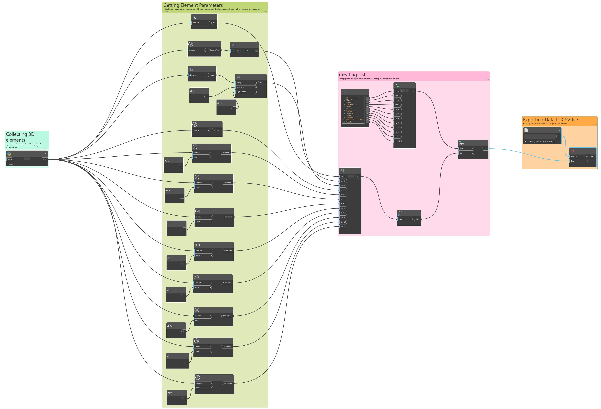

[View ModelParameters dynamo script](dynamo/ModelParameters.dyn)  

The `ModelParameters.csv` dataset contains element-level information including:

- Element ID
- Element Type
- Name
- Category
- Level
- Area
- Volume
- Length
- Mark
- Comments
- Phase Created
- Workset

The Dynamo workflow performs initial data preparation before exporting the resulting dataset to CSV.

### Element Collection and Geometry Filtering

The workflow begins with a Python script that searches the active Revit document and collects model elements that contain actual 3D solid geometry.

[View full Python script](dynamo/ElementCollector.py)

The initial approach considered was using Dynamo nodes alone. However, many of the available element-collection nodes require categories to be specified individually. This would make the workflow less efficient when the objective is to collect **all placed physical model elements** across the project.

A Python-based Revit API approach provided a more dynamic solution.

The script:
- Collects non-type element instances from the Revit document.
- Filters the collection to model categories.
- Excludes spatial elements such as Rooms, Spaces, and Areas.
- Checks whether an element supports geometry extraction.
- Evaluates its geometry for valid 3D solids.
- Examines nested `GeometryInstance` objects to identify solids within family instances.
- Retains elements containing valid 3D geometry.

The relevant portion of the script is shown below:

```diff
import clr
clr.AddReference('RevitAPI')
from Autodesk.Revit.DB import *

clr.AddReference('RevitServices')
import RevitServices
from RevitServices.Persistence import DocumentManager

doc = DocumentManager.Instance.CurrentDBDocument

# 1. Grab all element instances globally across the database background
collector = FilteredElementCollector(doc).WhereElementIsNotElementType()

physical_elements = []

geo_options = Options()
geo_options.DetailLevel = ViewDetailLevel.Coarse

# 2. Fully dynamic evaluation loop with exception handling
for elem in collector:
    if elem is None:
        continue
        
    cat = elem.Category
    if cat is None:
        continue # Drops non-graphical internal data maps
        
+   # Filter out non-3D objects early to save memory and processing time
+   if cat.CategoryType != CategoryType.Model:
+       continue # Excludes annotations, schedules, views, and sheets
        
+   if isinstance(elem, SpatialElement):
+       continue # Skip Spatial Elements (Rooms/Spaces/Areas) completely 

    # 3. DEFENSIVE CHECK: Ensure the object actually supports geometry properties 
    if not hasattr(elem, "get_Geometry"):
        continue

    # 4. Geometry Check (Separates true physical volumes from lines/curves)
    geo_elem = elem.get_Geometry(geo_options)
    if geo_elem is None:
        continue
        
    has_solid = False
    for geo_obj in geo_elem:
+       # Check direct geometry for 3D faces
        if isinstance(geo_obj, Solid) and geo_obj.Faces.Size > 0:
            has_solid = True
            break
+       # Dig into Family Instances (Doors, Windows, Furniture) to extract nested solids
        elif isinstance(geo_obj, GeometryInstance):
            instance_geo = geo_obj.GetInstanceGeometry()
            for sub_obj in instance_geo:
                if isinstance(sub_obj, Solid) and sub_obj.Faces.Size > 0:
                    has_solid = True
                    break
                    
    # 5. Keep only true physical volumes
    if has_solid:
        physical_elements.append(elem)

# Output clean instances directly to visual nodes
OUT = physical_elements
```
### Parameter Extraction
After the physical model elements were identified, parameter values were extracted using Dynamo nodes including:

- `Element.Id`
- `Element.ElementType`
- `Element.Name`
- `Element.GetCategory`
- `Parameter.ParameterByName`

The resulting values were organized using `List.Create` and `List.Transpose` so that each parameter became a separate column and each element occupied a corresponding row.

Column headers were added using `List.Create` and `List.AddItemToFront`.

The completed dataset was then exported using `Data.ExportCSV`, with the output path controlled through the `File Location` node.

The resulting file is:

`ModelParameters.csv`

### Handling Commas in Text Values
Commas were observed in some element names. Because the dataset was being exported as CSV, these characters could interfere with how the exported text was interpreted depending on the CSV-writing behavior.

To prevent element names from being split into unintended fields in the resulting dataset, `String.Replace` was used to remove commas from the relevant text values before export.

### B. Project Info & Warnings Dynamo Graph
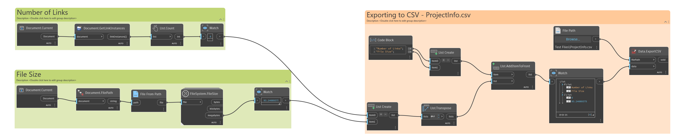

Two additional datasets were generated through `ProjectInfo&Warnings.dyn`:
- `ProjectInfo.csv`
- `Warnings.csv`  

[View ProjectInfo&Warnings dynamo script](dynamo/ProjectInfo&Warnings.dyn)

### Project Information
The `ProjectInfo.csv` dataset contains:
- Revit file size
- Number of Revit link instances

The number of links was obtained using:
`Document.Current → Document.GetLinkInstances → List.Count`

For the file size, the workflow uses:
`Document.Current → Document.FilePath → File from Path → FileSystem.FileSize`

The resulting values were organized into a list and exported as `ProjectInfo.csv`.

### Revit Warnings
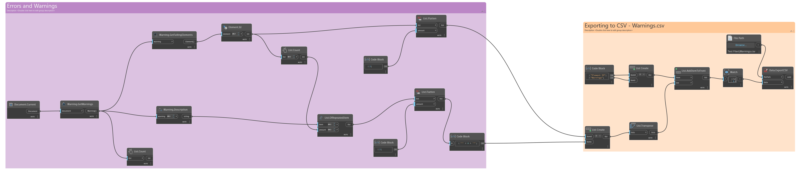
The `Warnings.csv` dataset contains Revit warning descriptions and the corresponding element IDs affected by each warning.

The workflow uses:
- `Warning.GetWarnings`
- `Warning.Description`
- `Warning.GetFailingElements`
- `Element.Id`

A challenge occurred because a single warning description can affect multiple elements. Consequently, the number of warning descriptions did not initially match the number of affected element IDs.

To align the datasets, List.Flatten, List.OfRepeatedItem, and List.Count were used to repeat each warning description according to the number of affected elements.

The warning description was also formatted before export to prevent commas within descriptions from being interpreted as unintended CSV separators.

The resulting dataset was exported as:
`Warnings.csv`

## 🧼 2. Data Cleaning and Transformation with Power Query
The three extracted datasets were imported into Power Query for data cleaning, type specification, transformation, and preparation for Power BI analysis.

### A. ModelsParameter Data 

**Before Cleaning and Transformation**
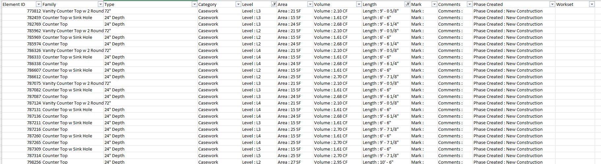

**After Cleaning and Transformation**
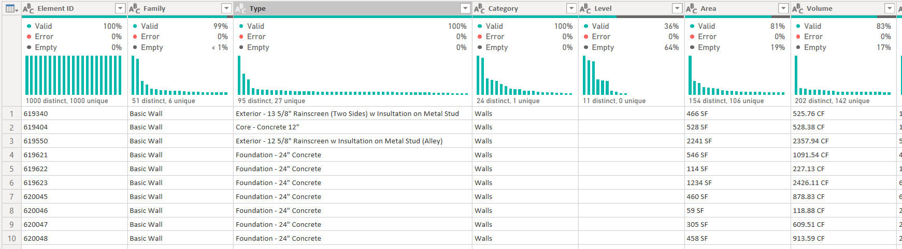
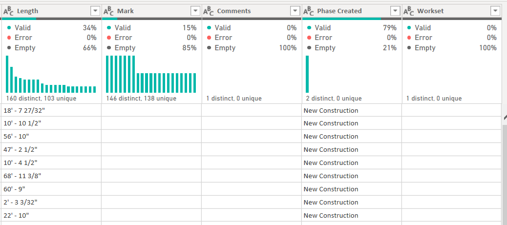

**Applied steps**  
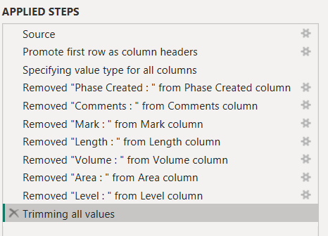

The following transformations were applied:
1. Promoted the first row to headers to correctly identify the dataset's column names.
2. Specified appropriate data types for each column so that Power Query and Power BI could correctly interpret and analyze the values.
3. Removed the parameter-name prefixes from fields including Phase Created, Comments, Mark, Length, Volume, Area, and Level.
4. Trimmed leading and trailing whitespace from text values.

The resulting table provides a cleaner structure for subsequent data modeling and visualization in Power BI.

### B. ProjectInfo Data 

**Before Cleaning and Transformation**  
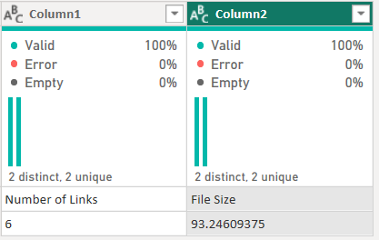

**After Cleaning and Transformation**  
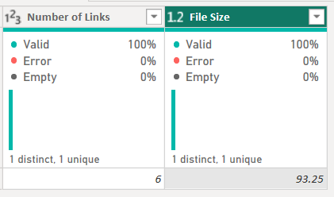

**Applied steps**  
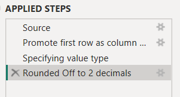  

The following transformations were applied: 
1. Promoted the first row to headers. 
2. Specified appropriate data types for each column.

This produced a structured project-level dataset containing file size and Revit link information.

### C. Warnings Data 

**Before Cleaning and Transformation**  
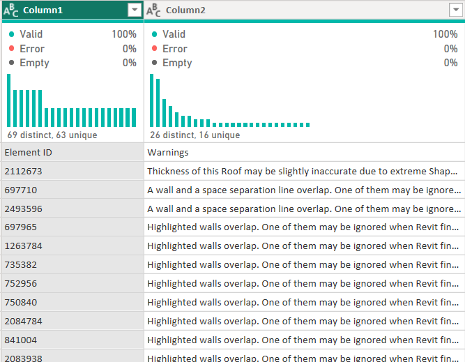

**After Cleaning and Transformation**  
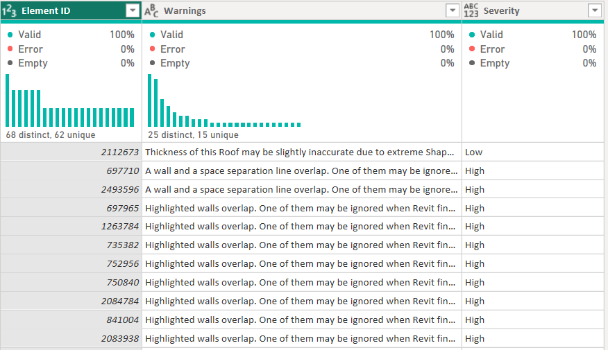

**Applied steps**  
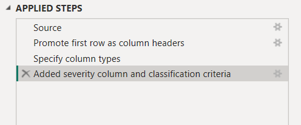  

The following transformations were applied:
1. Promoted the first row to headers. 
2. Specified appropriate data types for each column.
3. Added a Severity column to support warning analysis.

### Warning Severity Classification
A rule-based severity classification was introduced to help distinguish warning types within the dashboard.

The classification uses keywords found in the warning descriptions:

- High — keywords associated with conditions such as overlapping elements, duplicate IDs, duplicate marks, corruption, or invalid conditions.
- Medium — keywords associated with conditions such as disconnected, unconnected, not enclosed, or constraint-related issues.
- Low — warnings that do not match the defined High or Medium keyword groups.

Note: This classification is a project-defined analytical heuristic, not an official Revit severity rating. Its purpose is to provide a consistent method for grouping warnings for dashboard analysis.

The classification was implemented using a Power Query M expression:
```diff
= Table.AddColumn(#"Specify column types", "Severity", each let
text = if [Warnings] = null then "" else Text.Lower(Text.From([Warnings]))
in
if Text.Contains(text, "overlapping")
or Text.Contains(text, "overlap")
or Text.Contains(text, "identical")
or Text.Contains(text, "duplicate id")
or Text.Contains(text, "corrupt")
or Text.Contains(text, "duplicate mark")
or Text.Contains(text, "duplicate ""mark""")
or Text.Contains(text, "cannot keep")
or Text.Contains(text, "invalid")
then
"High"
else if Text.Contains(text, "axis")
or Text.Contains(text, "bounded")
or Text.Contains(text, "disconnected")
or Text.Contains(text, "misses")
or Text.Contains(text, "not connected")
or Text.Contains(text, "not enclosed")
or Text.Contains(text, "not joined")
or Text.Contains(text, "not properly connected")
or Text.Contains(text, "unconnected height")
or Text.Contains(text, "base constraint")
or Text.Contains(text, "top constraint")
or Text.Contains(text, "top is not connected")
or Text.Contains(text, "not intersect")
then
"Medium"
else
"Low")
```

## 📊 3. Power BI Dashboard
The processed datasets were brought into Power BI and organized into three analytical sections:
1. Executive Model Insights
2. Asset Metadata Matrix
3. Model Compliance & Risk Tracker

Together, these pages provide different levels of interaction, from high-level model overview to element-level metadata and warning analysis.


### A. Executive Model Insights 
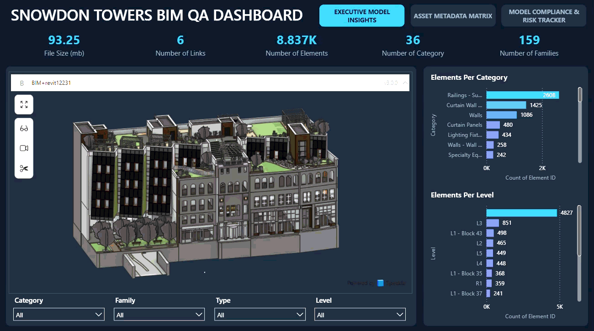  
The Executive Model Insights page provides a high-level overview of the Revit model and its physical elements. The page combines interactive 3D visualization through the Speckle visual with Power BI filtering and summary metrics.

Users can filter model elements using:
- Category
- Family
- Type
- Level

The Speckle visualization allows users to interact with the 3D model by:
- Rotating the view
- Cutting sections
- Selecting individual elements
- Viewing element information through tooltips

Tooltips provide additional information including:
- Element ID
- Category
- Family
- Type
- Level

Bar charts provide additional breakdowns of elements by:
- Category
- Level

Summary cards provide model-level information including:
- File size
- Number of links
- Number of elements
- Categories
- Families

The element-related metrics respond to the selected filters and visual interactions, while file size and link count remain model-level indicators.

### Practical Application
This page provides stakeholders with a consolidated view of the model without requiring them to navigate the Revit environment directly. The combination of 3D visualization, filtering, charts, and summary metrics can support model review by allowing users to explore the distribution and characteristics of model elements. File size and link count also provide basic indicators that can be monitored as part of model management and performance review.

### B. Asset Data Matrix
 

The Asset Metadata Matrix provides an element-level view of the extracted Revit parameters.

The matrix includes:
- Element ID
- Category
- Family
- Type
- Level
- Phase Created
- Area
- Length
- Volume
- Mark
- Workset
- Comments

Users can filter the dataset by:
- Category
- Family
- Type
- Level
- Phase Created

The table can also be sorted based on individual parameter values. The row count displayed at the bottom changes according to the active filters, allowing users to see how many elements are included within the current selection.

### Practical Application
This page can be used to review the completeness and consistency of element metadata. Blank or incomplete parameter values can be identified through the filters and matrix. Once an affected Element ID has been identified, the corresponding element can be located in Revit for further investigation or correction. The extracted dataset can therefore serve as a supporting reference for model quality review and parameter completeness checks.

### C. Model Compliance & Risk Tracker 
 
The Model Compliance & Risk Tracker provides an interactive view of Revit warnings and their associated elements.

The page combines:
- Warning descriptions
- Affected Element IDs
- Severity classification
- Warning counts
- Interactive 3D visualization

The Speckle visual provides a 3D representation of the affected model elements.

Users can filter the visualization through:
- Severity summary
- Active compliance error table

Summary cards display the number of warnings classified as:
- High
- Medium
- Low

### Practical Application
This page allows users to investigate model warnings without having to open the Revit model for every initial review. The warning table provides a direct connection between a warning description and the affected Element ID, while the severity classification provides a structured way to group and review the warning dataset. The combination of warning counts, tabular information, filtering, and 3D visualization can help stakeholders identify and investigate model issues more efficiently.

### 🔗 End-to-End Workflow
The complete pipeline can be summarized as:  

| Stage | Tool | Process | Output |
|---|---|---|---|
| **1. BIM Source** | Autodesk Revit | Provides the BIM model and source information | Revit Model |
| **2. Data Extraction** | Dynamo + Python / Revit API | Collects model elements, project information, and warnings | CSV Datasets |
| **3. Data Preparation** | Power Query | Cleans, transforms, and classifies the extracted data | Cleaned Datasets |
| **4. Analytics** | Power BI | Models and visualizes the processed BIM data | Interactive Dashboard |
| **5. BIM Analytics** | Power BI + Speckle | Combines BIM data with interactive 3D visualization | Model Insights & Compliance Analysis |


### 🎯 Project Outcome
The completed workflow demonstrates an end-to-end approach to transforming BIM information into structured, interactive analytics.

Rather than relying solely on the Revit interface, the pipeline separates the process into distinct stages:

Extract → Transform → Analyze → Visualize

This workflow demonstrates how BIM authoring data can be connected with data preparation and business intelligence tools to support model review, metadata analysis, and compliance monitoring.


